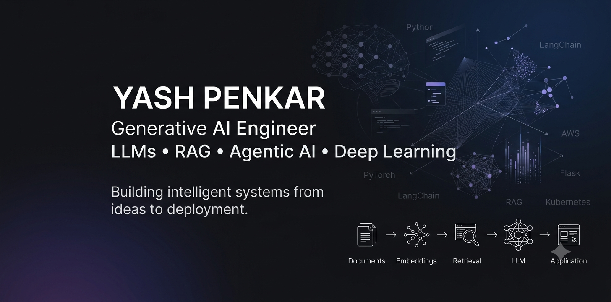

  

  Generative AI Engineer | LLMs | RAG

AI & ML Engineering graduate interested in building AI applications using Generative AI, LLMs, RAG, Machine Learning, and Deep Learning.

## 🧠 Interests

- Generative AI
- Large Language Models
- Retrieval-Augmented Generation (RAG)
- Machine Learning
- Deep Learning
- NLP

## ⚙️ Tech Stack

**Languages:** Python, JavaScript, C

**AI/ML:** PyTorch, Scikit-learn, OpenCV, NLTK, Pandas, NumPy

**Generative AI:** RAG, LangChain, Hugging Face, Sentence-Transformers, Gemini, Ollama

**Development:** Flask, Streamlit, REST APIs

**Cloud & DevOps:** AWS, Kubernetes

**Tools:** Git, GitHub, VS Code, Google Colab

## 🚀 Projects

- Enterprise Investment Banking Assistant using RAG
- AI-Powered Intelligent Quiz Generation Platform
- VRGen – AI-Based 2D Floor Plan to 3D Property Generation

## 🌱 Currently Learning

- AI Agents
- Advanced LLM Applications
- MLOps

## 📫 Connect With Me

- Email: yashpenkar.yp@gmail.com
- LinkedIn: https://www.linkedin.com/in/yash-penkar-1a8194260/
